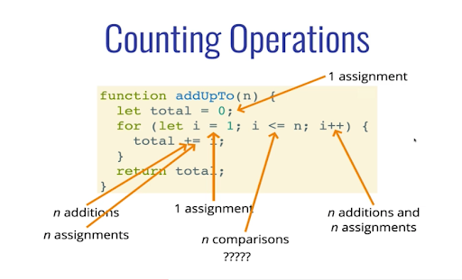
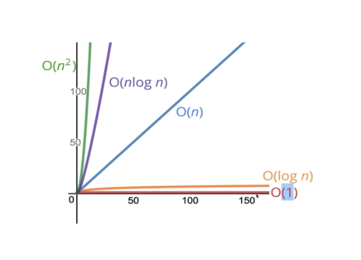

How can we determine which implementation of the same function is best?

When working with a huge data set, algorithm differences could save an hour every time it runs, for example.

Performance matters at that point and it's important to have a precise vocabulary to talk about how our code performs.

It's important to understand how a solution performs and how it compares to others. It's also good to understand the trade offs between approaches, because often it's not as cut and dry.

Comparison is made with the number of operations.

### Time Complexity

Depending on what we count, the number of operations can be as low as **2n** or as high as **5n+2**.

But we typically only care about the broad trends as the size of the input grows. We focus on what the worst case scenario is.
So the above for for loop operation would be **O(n)**, removing all the constants.

General rule of thumb:
1. Arithmetic operations are constant O(1)
2. Variable assignment is constant O(1)
3. Accessing elements in an array (by index) or object (by key) is constant O(1)
4. In a loop, the complexity is the length of the loop times the complexity of whatever happens inside of the loop O(3n) >> O(n)

The most common notations:

### Space Complexity
auxiliary space complexity refer to space required by the algorithm, not including space taken up by the inputs.

General rule of thumb:
1. Most primitives (booleans, numbers, undefined, null) are constant space O(1)
2. Strings reqruies O(n) space (where n is the string length)
3. Reference types are generally O(n), where n is the length (for arrays) or the number of keys (for objects)

### Logarithms
inverse of exponentiation
log2 8 = 3
2 to what power euals 8? 2^3 = 8 so the answer is 3.

Most common is the binary base of 2. For big O notation we omit the base and assume it's 2.

General rule of thumb:
- The logarithm of a number roughly measures the number of times you can divide that number by 2 before you get a value that's less than or equal to one.

O(log n) time complexity is fantastic.

### Some Notes
- Certain searching algorithms have logarithmic time complexity.
- Efficient sorting algorithms involve logarithms.
- Recursion sometimes involves logarithmic space complexity.
- Constant: O(1)
- Linear: O(n)
- Quadratic: O(n^2)